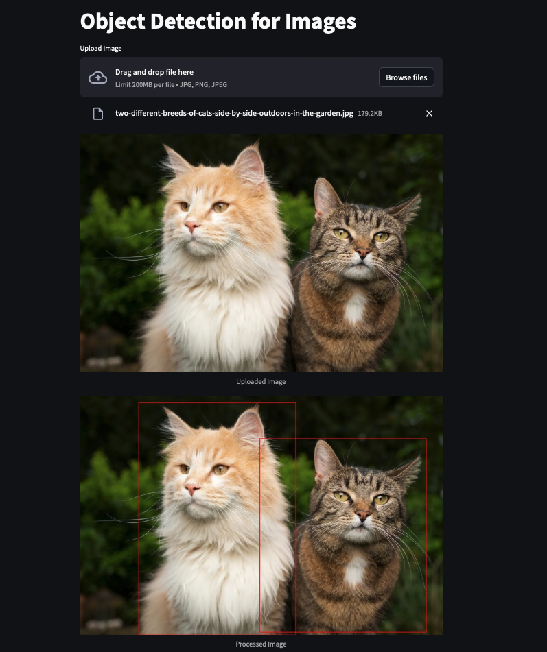

# Object Detection

The Object Detection project is aimed at identifying objects within images. By leveraging advanced machine learning models and computer vision techniques, this system can accurately recognize and classify various objects in real-time. This capability is crucial for a wide range of applications, including autonomous vehicles, security surveillance, augmented reality, and more, where understanding the visual context is essential.

## Table of Contents

1. [Introduction](#introduction)
2. [Installation](#installation)
3. [Demo](#demo)

## Introduction

This project is dedicated to the practical development of AI-driven applications using Streamlit, an open-source tool that facilitates the creation and deployment of web apps specifically designed for machine learning and data science initiatives. The centerpiece of this project is a web application capable of identifying and classifying objects within images in real-time, utilizing advanced machine learning models and computer vision techniques. This functionality is vital for a multitude of applications, such as autonomous vehicles, security surveillance systems, and augmented reality platforms, where accurate and immediate understanding of the visual environment is paramount.

## Installation

To run these applications locally, follow these steps:

1. Clone this repository:

```bash
git clone https://github.com/namdevdk2710/object-detection.git
cd object-detection
```

2. Install the required dependencies:

```bash
pip install -r requirements.txt
```

3. Run the applications using Streamlit:

```bash
streamlit run main.py
```

## Demo

<p align='center'>
  
</p>
